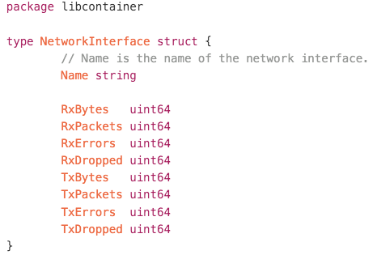
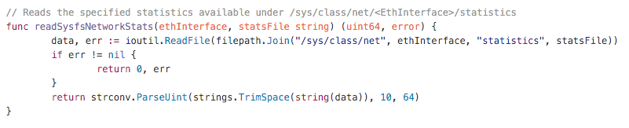
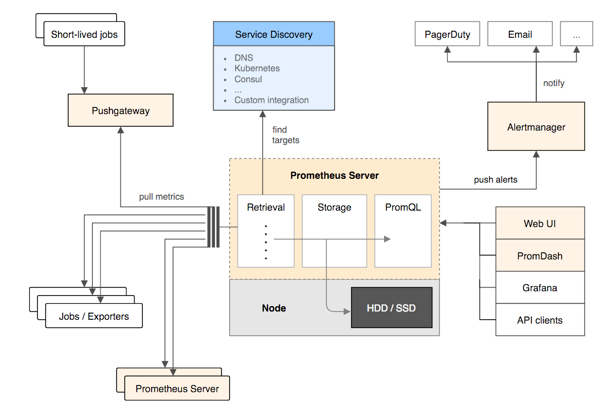
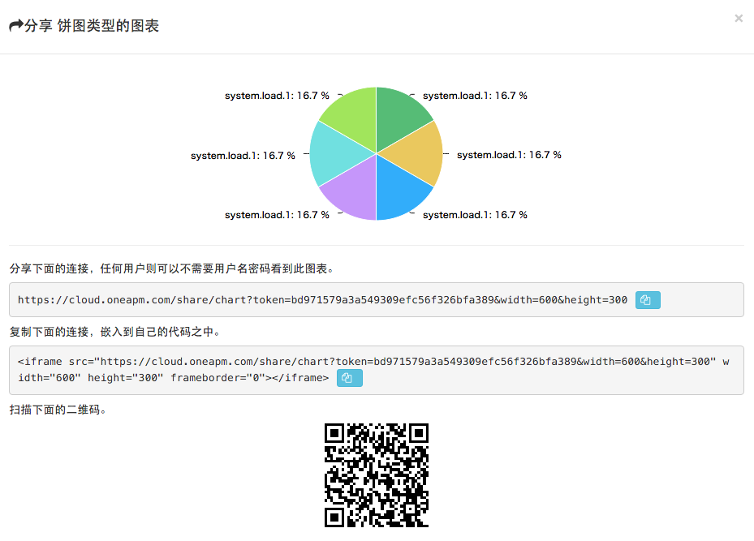
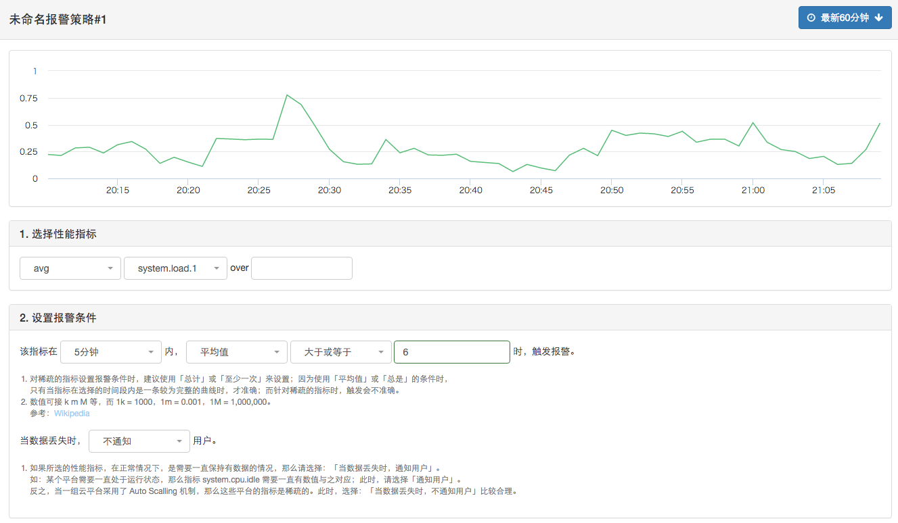
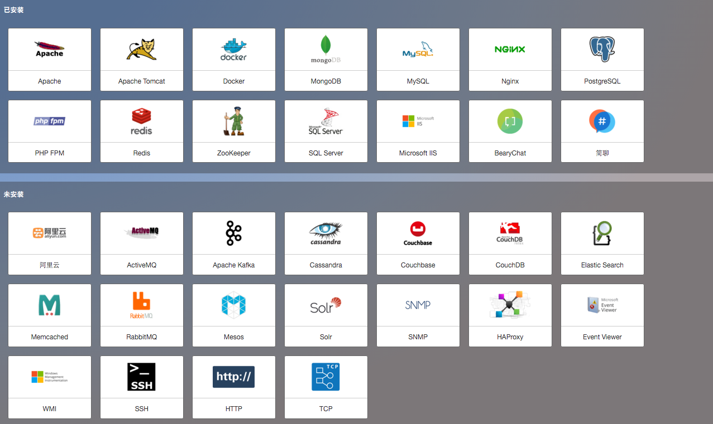
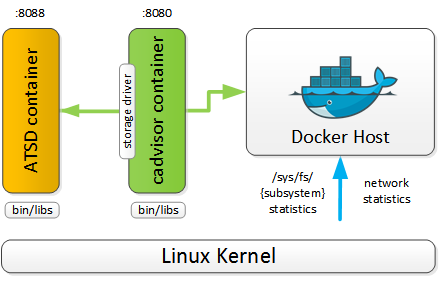

# 如何选择Docker监控


刘斌
2016/4/24

## Agenda

- 什么是监控
- Docker监控原理
- Docker监控方案

## 自我介绍


**Cloud Insight，蓝海讯通**

*https://cloud.oneapm.com/*

## 为什么监控

- 尽在掌握
- 炸药桶

## 监控目的

- 减少宕机时间
- 扩展和性能管理
- 资源计划
- 识别异常事件
- 故障排除、分析

## 监控层次

- 硬件
- OS、中间件（MySQL、Tomcat）
- 应用程序
- RUM

## Docker监控的挑战

- Docker特点
  - 像host但不是host
  - 量大
  - 生命周期短
- 监控盲点（断层）
 - 微服务
 - 集群
- 全方位
 - Host（VM） > Services > Containers > Apps

## Docker监控内容

- 配置信息
- Logs
- 主机和Daemon日志
- 容器信息
- **Metric（performance）**
- **Event**

## 内部监控 VS 外部监控

- 在容器内部监控
- 在宿主机上监控

## Docker监控基础

- `docker stats`
- Remote API
- 伪文件系统

## Docker监控内容

- CPU
- memory usage
- memory limit
- network IO

## docker stats

```bash
$ docker stats redis1 redis2
CONTAINER           CPU %               MEM USAGE/LIMIT     MEM %               NET I/O
redis1              0.07%               796 KB/64 MB        1.21%               788 B/648 B
redis2              0.07%               2.746 MB/64 MB      4.29%               1.266 KB/648 B
```

## 伪文件系统

- CPU、内存、磁盘
- 网络

## Cgroups

- CPU、内存、磁盘
- `/sys/fs/cgroup/{memory,cpuacct,blkio}/system.slice/${docker ps --no-trunc}.scope`

```bash
Standard: /sys/fs/cgroup/:cgroup/docker/:container_id
Systemd:  /sys/fs/cgroup/:cgroup/system.slice/docker-#{id}.scope
```

## Memory

- memory.stat


```bash
... ...
cache 11492564992
rss 1930993664
swap 0
pgfault 728281223
... ...
total_cache 11492564992
total_rss 1930993664
total_pgpgin 406632648
total_pgpgout 403355412
total_swap 0
total_pgfault 728281223
... ...
```

## Memory


## CPU

- cpuacct.stat
- docker.cpu.system
- docker.cpu.user

## Blkio

- blkio.io_queued_recursive
- blkio.io_service_time_recursive
- blkio.io_wait_time_recursive

## 网络数据

- 伪文件系统
- iptables
- 网络设备接口

## 数据源（veth device）

- Virtual Ethernet

```bash
$ CONTAINER_PID=`docker inspect -f '{{ .State.Pid }}' nginx`
$ mkdir -p /var/run/netns
$ ln -sf /proc/$CONTAINER_PID/ns/net /var/run/netns/$CONTAINER_ID
$ ip netns exec $CONTAINER_ID netstat -i 
```


## Docker容器网络信息-文件系统

```bash
$ CONTAINER_PID=`docker inspect -f '{{ .State.Pid }}' nginx `
$ cat /proc/$CONTAINER_PID/net/dev
```

## Docker容器网络信息-文件系统

```bash
$ pwd
/sys/class/net/veth559b656/statistics

$ ls
collisions     rx_crc_errors   rx_frame_errors   rx_packets         tx_compressed   tx_heartbeat_errors
multicast      rx_dropped      rx_length_errors  tx_aborted_errors  tx_dropped      tx_packets
rx_bytes       rx_errors       rx_missed_errors  tx_bytes           tx_errors       tx_window_errors
rx_compressed  rx_fifo_errors  rx_over_errors    tx_carrier_errors  tx_fifo_errors

```

## Docker容器网络接口数据的取得方式


## Docker容器网络接口数据的取得方式



## Docker容器网络接口数据的取得方式



## Docker监控方案

- 自己动手
- 开源软件
- SaaS

## 评价标准

- 功能
  - 满足
	- 信息详细程度
	- 查询的灵活程度
  - 报警 + API
- 灵活性
  - 定制
- 成本
  - 学习、开发
  - 维护
- 运维
  - 部署复杂程度
  - 高可用

## 自己动手

- 灵活性强
- 成本高

## 自己动手打造监控方案

- 采集
- 存储
- 展示
- 报警（动作）

## 自己动手

- Docker remote API
- 200L
- Reports the resource usage of Docker containers to InfluxDB
（https://github.com/mustafaakin/docker-resource-reporter）

## 性能指标采集

- tcollector
- StatsD
- collectd
- *cAdvisor*
- ... ...

##  StatsD

- Etsy/Flickr
- UDP/TCP
- 应用和协议

## Tcollector

- 来源于OpenTSDB
- 数据采集框架

## Collectd

- system statistics collection daemon
- 存储到RRD
- 插件机制（input/output）
- 简单报警功能

## cAdvisor（Container Advisor）


```bash
sudo docker run \
  --volume=/:/rootfs:ro \
  --volume=/var/run:/var/run:rw \
  --volume=/sys:/sys:ro \
  --volume=/var/lib/docker/:/var/lib/docker:ro \
  --publish=8080:8080 \
  --detach=true \
  --name=cadvisor \
  google/cadvisor
```

## 存储TSDB

- OpenTSDB
- Influxdb
- RRDTool
- Graphite
- ... ...

## 写入方式

- File、TCP/UDP
- HTTP
- JMX/JDBC/SNMP
- AWS/Docker/cAdvisor
- 消息队列（Kafka、ActiveMQ等）
    
## 数据展示

- Highcharts（Cloud Insight）
- D3（Datadog）
- echarts
- Google Charts
- Charts.js
- n3-charts

## 开源可视化工具


- Graphite
- Influxdb + Grafana
- Prometheus


## 开源方案

- cAdvisor（经典）+ InfluxDB + Grafana
- Zabbix/Nagios/Hawkular
- Fluentd
- Prometheus
- Riemann
- ATSD（Axibase Time Series Database）
- Hawkular
- ELK
  - ElasticSearch（存储）
  - Logstash（采集）
  - Kibana（展示）

## Zabbix

- 最经典（SaaS软件的最大敌人）
- 架构简单、清晰
- 文档丰富
- 包括采集、触发、告警
- agent支持用户自定义监控项
- 通过SNMP、ssh、telnet、IPMI、JMX监控
- 一套HTTP + JSON的接口

## Zabbix Docker Monitoring

- Zabbix Docker Monitoring

https://github.com/monitoringartist/zabbix-docker-monitoring

- Zabbix Template

## Fluentd


- Ruby
- 日志处理（log hub）
- 插件机制

## Graphite


 - 存储数值型时序列数据
 - 根据请求对数据进行可视化（画图）

## Graphite


- whisper：创建、更新RRD文件
- carbon：以守护进程的形式运行，接收数据写入请求
- carbon-cache：数据存储
- carbon-relay：分区和复制，位于carbon-cache之前，类似carbon-cache的负载均衡
- carbon-aggregator：数据集计，用于减轻carbon-cache的负载
- graphite-web：用于读取、展示数据的Web应用

## Prometheus



- 一体化
- 多维度
- 灵活查询语言
- 非分布式、单机自治
- 基于HTTP的pull模式（push需要中间网关）
- 仪表盘和告警
- LevelDB

## Riemann

- 事件处理
- Clojure实现
- Protocol Buffer
- 学习曲线？

## heapster

- K8s子项目
- source and sink
- 经典组合：heapster + Influxdb + grafana
- Sink：Kafka、stdout、gcm（Google Cloud Monitoring）、hawkular、monasca、riemann、opentsdb


## 开源软件的问题点

- 灵活性受限于upstream
- 维护成本高
- 定制难度大
- 技术栈

## SaaS

- turnkey解决方案
- 维护成本 ~ Zero
- 适合中小企业

## SaaS

- 传统APM
	- New Relic
	- AppDynamics
	- Dynatrace（Ruxit）
- 基础设施监控
	- Datadog
	- SysDig
	- Cloud Insight
	- clusterup
	- Scout
- Librato

## Datadog

- 国外最好
- 功能很强大
- 安装很简单
- 有点贵

## Cloud Insight

- 实时数据
- 历史数据（免费版最大保存15天）
- 仪表盘
- 混合监控
- 报警功能

## Cloud Insight Docker Overview


## Cloud Insight Graph


## Cloud Insight Share



## Cloud Insight Event Stream


## Cloud Insight Alert




## Cloud Insight Intergrations




## Cloud Insight Host Map


## Sysdig

- 免费工具
- SaaS服务 Sysdig Cloud
- 拓扑可视化

## Librato

- 数据聚合平台
- 简单探针
- 图表和报警
- 价格不贵

## axibase（ATSD）



- 实际上是一个TSDB
- 支持报警
- 预测功能

## SaaS的挑战

- 安全性
- 成本（迁移和使用成本）
- 和自有系统的兼容
- 内部抵抗（观念、个人爱好）

## 趋势

- 拓扑可视化
	- Weave Scope
	- Ruxit
	- Sysdig
- 标签机制
- 集群管理软件的集成
- 通过API打通
- 一体化

## 参考资料

- [Comparing Seven Monitoring Options for Docker](http://rancher.com/comparing-monitoring-options-for-docker-deployments/)
- [How to collect Docker metrics](https://www.datadoghq.com/blog/how-to-collect-docker-metrics/)
- [时序列数据库武斗大会](http://liubin.org/blog/2016/02/18/tsdb-intro/)
- [Fluentd Docker Metrics Input Plugin](https://github.com/kiyoto/fluent-plugin-docker-metrics)
- [Docker Runtime metrics](https://docs.docker.com/v1.8/articles/runmetrics/)

## Thanks


